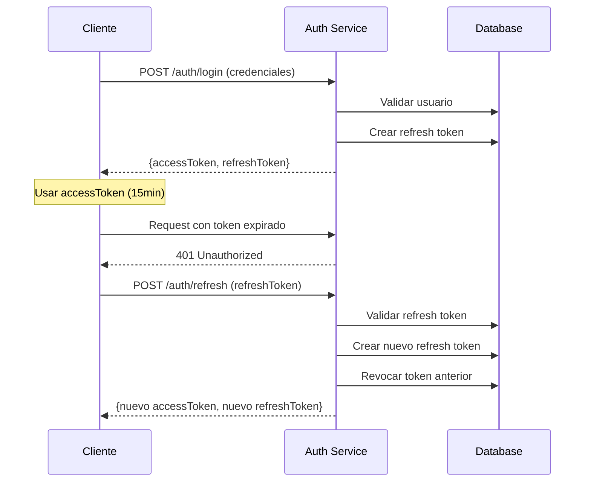

# SocgerFleet - Agent Documentation

## 📋 Proyecto Overview

**SocgerFleet** es una aplicación backend robusta desarrollada con **NestJS** y **TypeScript** que implementa un sistema completo de gestión de usuarios, roles y autenticación con refresh tokens. El proyecto está diseñado para ser una base sólida para aplicaciones empresariales que requieren control de acceso granular y gestión de usuarios.

### 🎯 Características Principales

- ✅ **Autenticación JWT completa** con access tokens (15 min) y refresh tokens (7 días)
- ✅ **Sistema de roles y permisos** con control de acceso basado en roles (RBAC)
- ✅ **CRUD completo de usuarios y roles** con validaciones avanzadas
- ✅ **Filtros y búsqueda avanzada** con paginación en todos los endpoints
- ✅ **Seguridad robusta** con bcrypt, guards, y rotación de tokens
- ✅ **Base de datos MySQL** con TypeORM y relaciones entre entidades
- ✅ **Documentación completa** con endpoints de prueba incluidos

## 🏗️ Arquitectura Técnica

### Stack Tecnológico

| Componente | Tecnología | Versión |
|------------|------------|---------|
| **Framework** | NestJS | 10.0.0 |
| **Lenguaje** | TypeScript | 5.1.3 |
| **Base de Datos** | MySQL | 8.0 |
| **ORM** | TypeORM | 0.3.26 |
| **Autenticación** | JWT + Passport | 11.0.0 |
| **Validación** | Class Validator | 0.14.2 |
| **Hashing** | bcrypt | 6.0.0 |
| **Containerización** | Docker | Latest |

### Estructura del Proyecto

```
src/
├── auth/                    # Módulo de autenticación
│   ├── decorators/         # Decoradores personalizados (@Roles)
│   ├── dto/               # DTOs para login, registro, refresh
│   ├── guards/            # Guards JWT, Local, Roles
│   ├── interfaces/        # Interfaces de tipos
│   ├── services/          # Servicio de refresh tokens
│   ├── strategies/        # Estrategias JWT y Local
│   ├── auth.controller.ts # Endpoints de autenticación
│   ├── auth.module.ts     # Configuración del módulo
│   └── auth.service.ts    # Lógica de autenticación
├── users/                  # Módulo de usuarios
│   ├── dto/               # DTOs para crear, actualizar, filtrar
│   ├── users.controller.ts # CRUD de usuarios
│   ├── users.module.ts    # Configuración del módulo
│   └── users.service.ts   # Lógica de usuarios
├── roles/                  # Módulo de roles
│   ├── dto/               # DTOs para crear, actualizar, filtrar
│   ├── roles.controller.ts # CRUD de roles
│   ├── roles.module.ts    # Configuración del módulo
│   └── roles.service.ts   # Lógica de roles
├── entities/              # Entidades de base de datos
│   ├── user.entity.ts     # Entidad Usuario
│   ├── role.entity.ts     # Entidad Rol
│   └── refresh-token.entity.ts # Entidad Refresh Token
├── database/              # Configuración de base de datos
└── main.ts               # Punto de entrada de la aplicación
```

## 🔐 Sistema de Autenticación

### Funcionamiento de Tokens

#### Access Tokens
- **Duración**: 15 minutos
- **Propósito**: Acceso a recursos protegidos
- **Contenido**: ID usuario, email, username, roles
- **Almacenamiento**: Cliente (localStorage/memoria)

#### Refresh Tokens
- **Duración**: 7 días
- **Propósito**: Renovar access tokens expirados
- **Características**: 
  - Rotación automática (nuevo token en cada refresh)
  - Tracking de dispositivos e IPs
  - Revocación individual o masiva
  - Limpieza automática de tokens expirados

### Endpoints de Autenticación

| Endpoint | Método | Descripción |
|----------|--------|-------------|
| `/auth/register` | POST | Registro de nuevos usuarios |
| `/auth/login` | POST | Inicio de sesión con credenciales |
| `/auth/refresh` | POST | Renovar access token |
| `/auth/logout` | POST | Logout individual (revoca un refresh token) |
| `/auth/logout-all` | POST | Logout masivo (revoca todos los tokens) |
| `/auth/profile` | POST | Obtener información del usuario autenticado |

### Flujo de Autenticación



## 👥 Sistema de Usuarios y Roles

### Entidades Principales

#### Usuario (User)
```typescript
{
  id: number;
  username: string;      // Único
  email: string;         // Único
  password: string;      // Hasheado con bcrypt
  firstName?: string;
  lastName?: string;
  isActive: boolean;     // Estado del usuario
  roles: Role[];         // Relación muchos a muchos
  createdAt: Date;
  updatedAt: Date;
}
```

#### Rol (Role)
```typescript
{
  id: number;
  name: string;          // Único (admin, user, editor)
  description?: string;
  users: User[];         // Relación muchos a muchos
  createdAt: Date;
  updatedAt: Date;
}
```

#### Refresh Token
```typescript
{
  id: number;
  token: string;         // Hash único del token
  userId: number;        // Referencia al usuario
  expiresAt: Date;       // Fecha de expiración
  isRevoked: boolean;    // Estado del token
  deviceInfo?: string;   // Información del dispositivo
  ipAddress?: string;    // IP del cliente
  createdAt: Date;
}
```

### Control de Acceso (RBAC)

#### Roles Predefinidos
- **admin**: Acceso completo a todos los recursos
- **user**: Acceso básico limitado

#### Guards Implementados
- **JwtAuthGuard**: Valida access tokens
- **LocalAuthGuard**: Autenticación con credenciales
- **RolesGuard**: Control de acceso basado en roles

#### Uso de Decoradores
```typescript
@UseGuards(JwtAuthGuard, RolesGuard)
@Roles('admin')
@Get('users')
async getUsers() {
  // Solo administradores pueden acceder
}
```

## 🔍 Sistema de Filtros y Búsqueda

### Características Avanzadas

#### Para Usuarios
- **Búsqueda general**: `?search=término`
- **Filtros específicos**: 
  - `?username=valor`
  - `?email=valor`
  - `?firstName=valor&lastName=valor`
  - `?isActive=true|false`
  - `?roleName=admin`
  - `?roleId=1`
- **Filtros de fecha**: `?createdFrom=2025-01-01&createdTo=2025-12-31`
- **Ordenamiento**: `?sortBy=username&sortOrder=ASC|DESC`
- **Paginación**: `?page=1&limit=10`

#### Para Roles
- **Búsqueda general**: `?search=término`
- **Filtros específicos**:
  - `?name=admin`
  - `?description=término`
  - `?minUsers=1&maxUsers=10`
- **Ordenamiento avanzado**: `?sortBy=userCount&sortOrder=DESC`

### Ejemplos de Uso

```http
# Buscar usuarios activos con rol admin, ordenados por fecha
GET /users?isActive=true&roleName=admin&sortBy=createdAt&sortOrder=DESC&page=1&limit=5

# Buscar roles con más de 2 usuarios
GET /roles?minUsers=2&sortBy=userCount&sortOrder=DESC

# Búsqueda rápida de usuarios
GET /users/search?q=admin&limit=5
```

## 🐳 Configuración de Docker

### Docker Compose
El proyecto incluye una configuración completa de Docker con:

```yaml
services:
  mysql:
    image: mysql:8.0
    environment:
      MYSQL_DATABASE: socgerfleet
      MYSQL_USER: socger
    ports:
      - "3306:3306"
    volumes:
      - mysql_data:/var/lib/mysql
      - ./docker/mysql/init:/docker-entrypoint-initdb.d

  phpmyadmin:
    image: phpmyadmin:latest
    ports:
      - "8080:80"
    depends_on:
      - mysql
```

### Inicialización de Base de Datos
- **Archivo**: `docker/mysql/init/01_create_tables.sql`
- **Función**: Crear tablas iniciales y datos de prueba
- **Usuario admin predefinido**: admin@socgerfleet.com / admin123

## 🚀 Instalación y Configuración

### Requisitos Previos
- Node.js 18+ con npm
- Docker y Docker Compose
- Git

### Pasos de Instalación

1. **Clonar el repositorio**
```bash
git clone <repositorio>
cd socgerfleet
```

2. **Instalar dependencias**
```bash
npm install
```

3. **Configurar variables de entorno**
```bash
# Crear archivo .env con:
DB_HOST=localhost
DB_PORT=3306
DB_USERNAME=socger
DB_PASSWORD=dcb4f2e8106a0ef44c3f530d3ae3f9fd
DB_NAME=socgerfleet
JWT_SECRET=tu_jwt_secret_muy_seguro
JWT_EXPIRES_IN=15m
```

4. **Iniciar servicios Docker**
```bash
docker-compose up -d
```

5. **Ejecutar la aplicación**
```bash
# Desarrollo
npm run start:dev

# Producción
npm run build
npm run start:prod
```

### Acceso a Servicios
- **API**: http://localhost:3000
- **phpMyAdmin**: http://localhost:8080
- **Base de datos**: localhost:3306

## 🧪 Testing y Desarrollo

### Scripts Disponibles
```bash
npm run start:dev      # Desarrollo con watch mode
npm run build          # Compilar para producción
npm run test           # Ejecutar tests unitarios
npm run test:e2e       # Ejecutar tests end-to-end
npm run lint           # Verificar código con ESLint
npm run format         # Formatear código con Prettier
```

### Tests de API
El proyecto incluye archivos de test completos:

- **api-tests.http**: Tests de CRUD de usuarios y roles
- **refresh-tokens-tests.http**: Tests de sistema de autenticación

### Usar REST Client Extension
1. Instalar "REST Client" en VS Code
2. Abrir archivos `.http` en `test endpoints with REST CLIENT extension/`
3. Hacer clic en "Send Request" sobre cada endpoint

## 📊 Casos de Uso Principales

### 1. Gestión de Usuarios
```typescript
// Crear usuario con roles
POST /users
{
  "username": "nuevo_usuario",
  "email": "user@domain.com",
  "password": "password123",
  "firstName": "Nombre",
  "lastName": "Apellido",
  "roleIds": [2] // Asignar rol de usuario
}

// Buscar usuarios activos con filtros
GET /users?isActive=true&search=admin&page=1&limit=10
```

### 2. Control de Acceso
```typescript
// Login y obtención de tokens
POST /auth/login
{
  "email": "admin@socgerfleet.com",
  "password": "admin123"
}

// Renovar token expirado
POST /auth/refresh
{
  "refreshToken": "token_refresh_actual"
}
```

### 3. Gestión de Roles
```typescript
// Crear nuevo rol
POST /roles
{
  "name": "editor",
  "description": "Editor de contenido"
}

// Asignar rol a usuario
POST /users/{userId}/roles/{roleId}
```

## 🔒 Seguridad Implementada

### Medidas de Seguridad
- ✅ **Hash de contraseñas** con bcrypt (salt rounds: 10)
- ✅ **Validación de entrada** con class-validator
- ✅ **Sanitización de datos** automática
- ✅ **Control de acceso** basado en roles
- ✅ **Rotación de refresh tokens** por seguridad
- ✅ **Tracking de dispositivos** e IPs
- ✅ **Limpieza automática** de tokens expirados
- ✅ **Exclusión de campos sensibles** en respuestas

### Configuración de JWT
```typescript
{
  secret: process.env.JWT_SECRET,
  signOptions: { expiresIn: '15m' }, // Access token
  // Refresh tokens: 7 días configurables
}
```

## 📈 Métricas y Monitoring

### Endpoints de Salud
- `GET /`: Verificar que la aplicación esté funcionando
- Logs automáticos de errores y operaciones

### Base de Datos
- Índices optimizados en campos únicos
- Relaciones con CASCADE para integridad
- Timestamps automáticos (createdAt, updatedAt)

## 🚀 Próximas Mejoras Sugeridas

### Funcionalidades Pendientes
- [ ] **Rate limiting** para prevenir ataques de fuerza bruta
- [ ] **Logs estructurados** con Winston
- [ ] **Métricas de performance** con Prometheus
- [ ] **Cache** con Redis para consultas frecuentes
- [ ] **Notificaciones** por email (registro, cambio de password)
- [ ] **2FA** (Two-Factor Authentication)
- [ ] **Swagger/OpenAPI** para documentación automática
- [ ] **Tests automatizados** más completos
- [ ] **CI/CD Pipeline** con GitHub Actions

### Optimizaciones Técnicas
- [ ] **Soft delete** para usuarios y roles
- [ ] **Audit log** para tracking de cambios
- [ ] **Conexiones de DB** optimizadas con pool
- [ ] **Validaciones personalizadas** más avanzadas
- [ ] **Middlewares** de logging y error handling

## 📞 Información de Contacto

- **Proyecto**: SocgerFleet Backend API
- **Framework**: NestJS 10.0.0
- **Documentación**: Este archivo AGENTS.md
- **Tests**: Carpeta `test endpoints with REST CLIENT extension/`

### Links Útiles
- [NestJS Documentation](https://docs.nestjs.com)
- [TypeORM Documentation](https://typeorm.io)
- [JWT.io](https://jwt.io) para debugging de tokens

---

> **Nota**: Este proyecto está listo para producción con todas las características de seguridad y funcionalidad implementadas. Para uso en producción, asegúrate de cambiar las credenciales por defecto y configurar variables de entorno seguras.