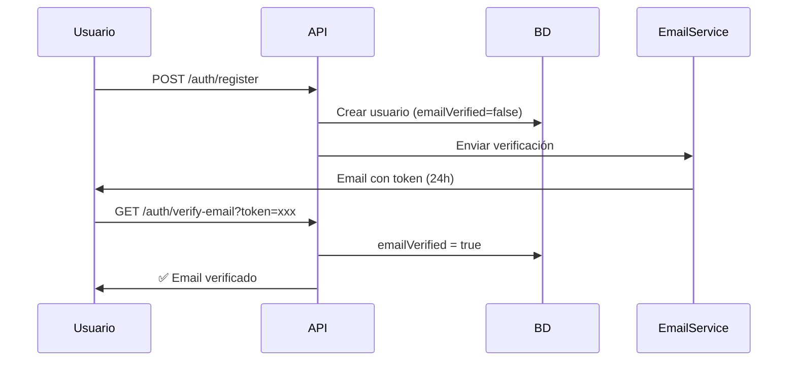
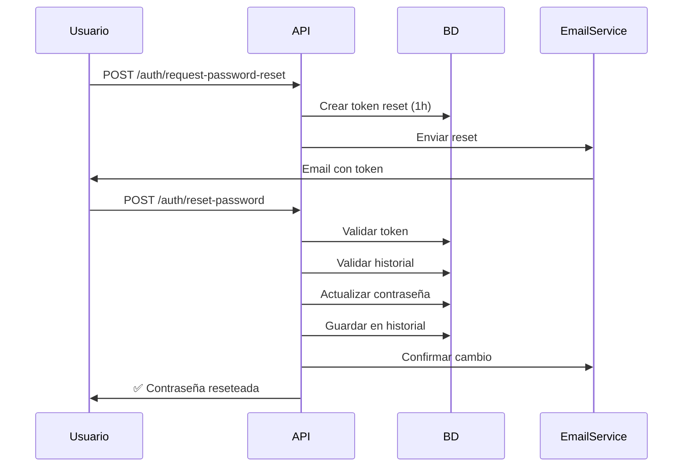
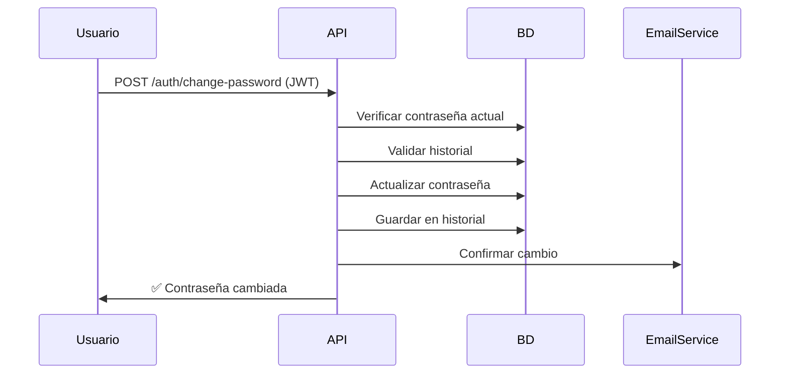

# 🔐 Implementación de Gestión de Contraseñas en SocgerFleet

## 📋 Resumen

Se ha implementado un sistema completo de **Gestión de Contraseñas** en SocgerFleet que incluye:

- ✅ **Reset/recuperación de contraseñas** vía email
- ✅ **Confirmación de email** en registro
- ✅ **Cambio de contraseña** con validación
- ✅ **Historial de contraseñas** (últimas 5)
- ✅ **Validación de contraseñas fuertes**
- ✅ **Notificaciones por email**

---

## 🎯 Funcionalidades Implementadas

### **1. Verificación de Email al Registrarse**

Cuando un usuario se registra, automáticamente recibe un email con un enlace para verificar su cuenta.

**Flujo:**
1. Usuario se registra → `/auth/register`
2. Sistema envía email con token de verificación (válido 24 horas)
3. Usuario hace clic en el enlace del email
4. Token se valida y el email se marca como verificado

**Endpoint:**
```http
GET /auth/verify-email?token=abc123...
```

**Response:**
```json
{
  "message": "Email verificado exitosamente"
}
```

### **2. Solicitar Reset de Contraseña**

Permite al usuario solicitar un cambio de contraseña si la olvidó.

**Endpoint:**
```http
POST /auth/request-password-reset
Content-Type: application/json

{
  "email": "usuario@ejemplo.com"
}
```

**Response:**
```json
{
  "message": "Si el email existe, recibirás un enlace de recuperación en breve"
}
```

**Características de Seguridad:**
- Por seguridad, siempre retorna el mismo mensaje (no revela si el email existe)
- Token válido por 1 hora
- Solo un token activo por usuario (los anteriores se invalidan)
- Email con enlace para resetear

### **3. Resetear Contraseña con Token**

Permite establecer una nueva contraseña usando el token recibido por email.

**Endpoint:**
```http
POST /auth/reset-password
Content-Type: application/json

{
  "token": "abc123def456...",
  "newPassword": "NuevaPass123!"
}
```

**Validaciones:**
- Token válido y no expirado
- Token no usado previamente
- Contraseña cumple requisitos de complejidad
- Contraseña no está en el historial (últimas 5)

**Response:**
```json
{
  "message": "Contraseña reseteada exitosamente"
}
```

### **4. Cambiar Contraseña (Usuario Autenticado)**

Permite al usuario cambiar su contraseña conociendo la actual.

**Endpoint:**
```http
POST /auth/change-password
Authorization: Bearer <access_token>
Content-Type: application/json

{
  "currentPassword": "MiPassActual123!",
  "newPassword": "NuevaPass456!"
}
```

**Validaciones:**
- Usuario autenticado (requiere JWT)
- Contraseña actual correcta
- Nueva contraseña diferente a la actual
- Nueva contraseña cumple requisitos
- Nueva contraseña no está en el historial

**Response:**
```json
{
  "message": "Contraseña cambiada exitosamente"
}
```

---

## 🏗️ Arquitectura

### **Nuevas Entidades**

#### **1. PasswordHistory**
```typescript
@Entity('password_history')
export class PasswordHistory {
  id: number;
  userId: number;
  password: string;  // Hash de la contraseña
  createdAt: Date;
}
```

**Propósito:** Almacenar las últimas 5 contraseñas del usuario para evitar reutilización.

#### **2. VerificationToken**
```typescript
@Entity('verification_tokens')
export class VerificationToken {
  id: number;
  userId: number;
  token: string;  // Token único
  type: TokenType;  // 'email_verification' | 'password_reset'
  expiresAt: Date;
  isUsed: boolean;
  createdAt: Date;
}
```

**Propósito:** Gestionar tokens de verificación de email y reset de contraseña.

#### **3. User - Campo Añadido**
```typescript
@Column({ name: 'email_verified', default: false })
emailVerified: boolean;
```

**Propósito:** Indicar si el usuario ha verificado su email.

### **Nuevos Servicios**

#### **1. EmailService**
**Ubicación:** `src/auth/services/email.service.ts`

**Responsabilidades:**
- Enviar email de verificación
- Enviar email de reset de contraseña
- Enviar email de confirmación de cambio

**Configuración:**
```typescript
// Variables de entorno
MAIL_HOST=localhost
MAIL_PORT=1025
MAIL_SECURE=false
MAIL_USER=
MAIL_PASS=
MAIL_FROM=SocgerFleet <noreply@socgerfleet.com>
APP_URL=http://localhost:3000
```

#### **2. PasswordManagementService**
**Ubicación:** `src/auth/services/password-management.service.ts`

**Responsabilidades:**
- Generar tokens de verificación
- Validar tokens
- Gestionar historial de contraseñas
- Validar contraseñas contra historial
- Orquestar flujos de verificación y reset

**Métodos principales:**
```typescript
sendVerificationEmail(user: User): Promise<void>
verifyEmail(token: string): Promise<void>
requestPasswordReset(email: string): Promise<void>
resetPassword(token: string, newPassword: string): Promise<void>
changePassword(userId: number, currentPassword: string, newPassword: string): Promise<void>
cleanExpiredTokens(): Promise<void>
```

### **Nuevos DTOs**

1. **RequestPasswordResetDto** - Solicitar reset
2. **ResetPasswordDto** - Resetear con token
3. **ChangePasswordDto** - Cambiar contraseña autenticado
4. **VerifyEmailDto** - Verificar email

Todos incluyen:
- Validaciones con `class-validator`
- Documentación con decoradores de Swagger
- Mensajes de error descriptivos

---

## 🔒 Seguridad Implementada

### **Validación de Contraseñas Fuertes**

Las contraseñas deben cumplir:
- ✅ Mínimo 8 caracteres
- ✅ Al menos una letra mayúscula
- ✅ Al menos una letra minúscula
- ✅ Al menos un número
- ✅ Al menos un carácter especial (@$!%*?&)

**Regex utilizado:**
```typescript
/^(?=.*[a-z])(?=.*[A-Z])(?=.*\d)(?=.*[@$!%*?&])[A-Za-z\d@$!%*?&]/
```

### **Historial de Contraseñas**

- Se guardan las últimas **5 contraseñas** (hasheadas)
- No se puede reutilizar ninguna de ellas
- Las contraseñas antiguas se eliminan automáticamente
- Comparación segura con `bcrypt.compare()`

### **Tokens de Verificación**

**Email Verification:**
- Válido por **24 horas**
- Un solo uso
- Se invalida automáticamente tras uso
- Tokens anteriores se invalidan al generar uno nuevo

**Password Reset:**
- Válido por **1 hora** (mayor seguridad)
- Un solo uso
- Tokens anteriores se invalidan al generar uno nuevo
- Por seguridad, no se revela si el email existe

### **Protección contra Abuso**

- Tokens únicos generados con `crypto.randomBytes(32)`
- Tokens hasheados y únicos en BD
- Validación de expiración
- Validación de uso previo
- Limpieza automática de tokens expirados

---

## 📧 Sistema de Emails

### **Configuración de Desarrollo (MailHog/MailCatcher)**

Para desarrollo local, se recomienda usar **MailHog** o **MailCatcher** para capturar emails:

```yaml
# docker-compose.yml
mailhog:
  image: mailhog/mailhog
  ports:
    - "1025:1025"  # SMTP
    - "8025:8025"  # Web UI
```

Acceder a la interfaz web: http://localhost:8025

### **Configuración de Producción**

Para producción, configurar un servicio SMTP real:

**Opciones:**
- **SendGrid** - 100 emails/día gratis
- **AWS SES** - Muy económico
- **Mailgun** - 5,000 emails/mes gratis
- **Gmail SMTP** - Para pruebas pequeñas

**Ejemplo con Gmail:**
```env
MAIL_HOST=smtp.gmail.com
MAIL_PORT=587
MAIL_SECURE=false
MAIL_USER=tu-email@gmail.com
MAIL_PASS=tu-app-password
MAIL_FROM=SocgerFleet <noreply@socgerfleet.com>
APP_URL=https://tudominio.com
```

### **Templates de Email**

Todos los emails incluyen:
- ✅ Diseño HTML responsive
- ✅ Botones con enlaces directos
- ✅ Información de expiración
- ✅ Instrucciones claras
- ✅ Branding consistente

---

## 🗄️ Base de Datos

### **Scripts SQL Aplicados**

**Ubicación:** `docker/mysql/init/02_password_management.sql`

```sql
-- Agregar columna de verificación de email
ALTER TABLE users ADD COLUMN email_verified TINYINT(1) DEFAULT 0;

-- Tabla de historial de contraseñas
CREATE TABLE password_history (
  id INT AUTO_INCREMENT PRIMARY KEY,
  user_id INT NOT NULL,
  password VARCHAR(255) NOT NULL,
  created_at DATETIME(6) NOT NULL DEFAULT CURRENT_TIMESTAMP(6),
  FOREIGN KEY (user_id) REFERENCES users(id) ON DELETE CASCADE,
  INDEX idx_user_id (user_id),
  INDEX idx_created_at (created_at)
);

-- Tabla de tokens de verificación
CREATE TABLE verification_tokens (
  id INT AUTO_INCREMENT PRIMARY KEY,
  user_id INT NOT NULL,
  token VARCHAR(255) NOT NULL UNIQUE,
  type ENUM('email_verification', 'password_reset') NOT NULL,
  expires_at DATETIME NOT NULL,
  is_used TINYINT(1) DEFAULT 0,
  created_at DATETIME(6) NOT NULL DEFAULT CURRENT_TIMESTAMP(6),
  FOREIGN KEY (user_id) REFERENCES users(id) ON DELETE CASCADE,
  INDEX idx_token (token),
  INDEX idx_user_id (user_id),
  INDEX idx_type (type),
  INDEX idx_expires_at (expires_at)
);
```

### **Migraciones**

Los scripts SQL se ejecutan automáticamente al levantar Docker:

```bash
docker compose down -v   # Eliminar volúmenes
docker compose up -d     # Recrear con nuevas tablas
```

---

## 📚 Documentación Swagger

Todos los nuevos endpoints están documentados en Swagger:

**Acceso:** http://localhost:3000/api/docs

### **Sección: Password Management**

Todos los endpoints incluyen:
- ✅ Descripción detallada
- ✅ Ejemplos de request/response
- ✅ Códigos de error posibles
- ✅ Validaciones documentadas
- ✅ Try it out funcional

### **Ejemplo de Flujo en Swagger**

1. **Registrarse:**
   - `POST /auth/register`
   - Se envía email de verificación

2. **Verificar email:**
   - `GET /auth/verify-email?token=xxx`

3. **Olvidé mi contraseña:**
   - `POST /auth/request-password-reset`
   - Se envía email con token

4. **Resetear contraseña:**
   - `POST /auth/reset-password`
   - Proporcionar token y nueva contraseña

5. **Cambiar contraseña (autenticado):**
   - Hacer login primero
   - Authorize en Swagger con JWT
   - `POST /auth/change-password`

---

## 🧪 Testing

### **Probar con REST Client**

Crear archivo: `test endpoints with REST CLIENT extension/password-management-tests.http`

```http
### 1. Registrarse (recibe email de verificación)
POST http://localhost:3000/auth/register
Content-Type: application/json

{
  "username": "testuser",
  "email": "test@example.com",
  "password": "TestPass123!",
  "firstName": "Test",
  "lastName": "User"
}

### 2. Solicitar reset de contraseña
POST http://localhost:3000/auth/request-password-reset
Content-Type: application/json

{
  "email": "test@example.com"
}

### 3. Resetear contraseña (usar token del email)
POST http://localhost:3000/auth/reset-password
Content-Type: application/json

{
  "token": "abc123...",
  "newPassword": "NewPass456!"
}

### 4. Cambiar contraseña (autenticado)
POST http://localhost:3000/auth/change-password
Authorization: Bearer {{accessToken}}
Content-Type: application/json

{
  "currentPassword": "NewPass456!",
  "newPassword": "AnotherPass789!"
}

### 5. Verificar email
GET http://localhost:3000/auth/verify-email?token=xyz789...
```

### **Testing Manual con MailHog**

1. Levantar MailHog:
   ```bash
   docker run -d -p 1025:1025 -p 8025:8025 mailhog/mailhog
   ```

2. Configurar `.env`:
   ```env
   MAIL_HOST=localhost
   MAIL_PORT=1025
   ```

3. Registrar usuario o solicitar reset

4. Abrir http://localhost:8025

5. Ver el email recibido y copiar el token

6. Usar el token en los endpoints correspondientes

---

## 🚀 Despliegue

### **Variables de Entorno Requeridas**

```env
# Email Configuration
MAIL_HOST=smtp.sendgrid.net
MAIL_PORT=587
MAIL_SECURE=false
MAIL_USER=apikey
MAIL_PASS=SG.xxxxxxxxxxxxx
MAIL_FROM=SocgerFleet <noreply@tudominio.com>

# Application URL (importante para enlaces en emails)
APP_URL=https://api.tudominio.com
```

### **Consideraciones de Producción**

1. **HTTPS obligatorio** - Los tokens viajan en URLs
2. **Rate limiting** - Proteger endpoints públicos
3. **Logging** - Monitorear intentos de reset
4. **Email delivery** - Configurar SPF, DKIM, DMARC
5. **Cron job** - Limpiar tokens expirados periódicamente

### **Limpieza de Tokens (Opcional)**

Crear un cron job o tarea programada para limpiar tokens expirados:

```typescript
// En un módulo de tareas programadas
@Cron('0 0 * * *') // Cada medianoche
async cleanExpiredTokens() {
  await this.passwordManagementService.cleanExpiredTokens();
}
```

---

## 📊 Métricas y Monitoreo

### **Eventos a Monitorear**

- Email de verificación enviado
- Email verificado exitosamente
- Solicitud de reset de contraseña
- Contraseña reseteada
- Contraseña cambiada
- Intentos fallidos de validación
- Tokens expirados

### **Logging Implementado**

El servicio incluye logging automático de:
- Envío de emails (éxito/error)
- Validaciones de tokens
- Cambios de contraseña

---

## 🔄 Flujo Completo de Usuario

### **Escenario 1: Nuevo Usuario**



### **Escenario 2: Olvidé mi Contraseña**



### **Escenario 3: Cambiar Contraseña**



---

## ✅ Checklist de Implementación

- [x] Instalar dependencias (nodemailer, @nestjs-modules/mailer)
- [x] Crear entidad PasswordHistory
- [x] Crear entidad VerificationToken
- [x] Agregar campo emailVerified a User
- [x] Crear scripts SQL de migración
- [x] Crear EmailService
- [x] Crear PasswordManagementService
- [x] Crear DTOs de validación
- [x] Actualizar AuthService con nuevos métodos
- [x] Añadir endpoints al AuthController
- [x] Actualizar AuthModule con providers e imports
- [x] Documentar en Swagger
- [x] Actualizar README.md
- [x] Actualizar .env.example
- [x] Recrear base de datos con nuevas tablas
- [x] Documentar implementación completa

---

## 🎓 Aprendizajes Clave

### **Mejores Prácticas Aplicadas**

1. **Tokens de un solo uso** - Mayor seguridad
2. **Expiración corta para resets** (1h) vs verificación (24h)
3. **No revelar información** - Respuestas genéricas en reset
4. **Historial de contraseñas** - Evitar reutilización
5. **Validación de contraseñas fuertes** - Requisitos claros
6. **Emails transaccionales** - Confirmación de cambios
7. **Invalidación de tokens anteriores** - Al generar nuevos
8. **Limpieza de datos antiguos** - Mantener BD limpia

### **Consideraciones de UX**

- Mensajes claros y descriptivos
- Emails con diseño profesional
- Instrucciones paso a paso
- Información de expiración visible
- Botones de acción destacados

---

## 📖 Referencias

- [NestJS Authentication](https://docs.nestjs.com/security/authentication)
- [Nodemailer Documentation](https://nodemailer.com/)
- [OWASP Password Guidelines](https://owasp.org/www-project-authentication-cheat-sheet/)
- [JWT Best Practices](https://tools.ietf.org/html/rfc8725)

---

## 🆘 Soporte y FAQ

### **P: ¿Los emails se envían en desarrollo?**
R: Sí, pero se capturan en MailHog (localhost:8025) para no enviar emails reales.

### **P: ¿Cuántas contraseñas se guardan en el historial?**
R: Las últimas 5 contraseñas (configurable en `PASSWORD_HISTORY_LIMIT`).

### **P: ¿Qué pasa si un token expira?**
R: El usuario debe solicitar un nuevo token. Los expirados se pueden limpiar con un cron job.

### **P: ¿Se puede personalizar el diseño de los emails?**
R: Sí, los templates están en `EmailService`. Se pueden usar plantillas Handlebars.

### **P: ¿Los tokens están hasheados en la BD?**
R: No, los tokens son únicos y aleatorios, pero se guardan en texto plano para validación. Se valida expiración y uso único.

---

**Implementación completada el:** 17 de enero de 2026  
**Versión:** 1.0.0  
**Estado:** ✅ Producción Ready
